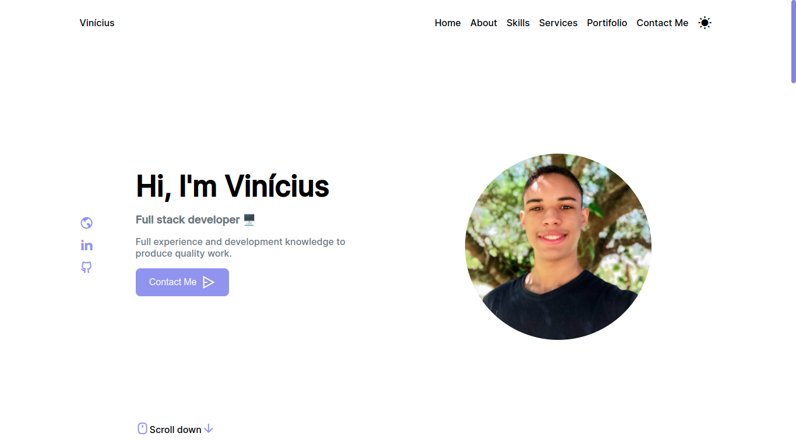

  
  

  
### 🚀 Technologies
- HTML5
- CSS
- Javascript

### 💻 Project
Personal portfolio. You can use it as a basis to create your own.
  
Here is the deploy [link](https://vcosta-portifolio.vercel.app/index.html).

### 📝 License
This project is under the MIT license. See the [file](LICENSE) for more details.
